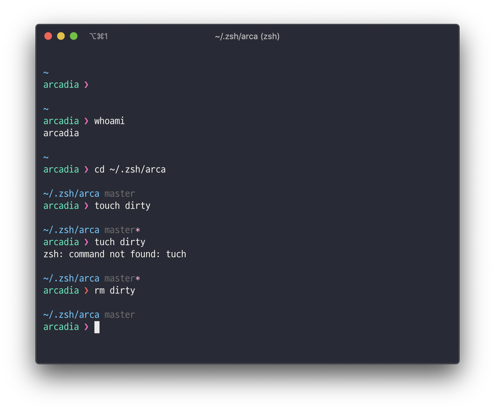

# Arca
> Pretty and Simple ZSH prompt


Based on pure(https://github.com/sindresorhus/pure)

## Install

### Manually

Clone this repo somewhere. Here we'll use `$HOME/.zsh/arca`.

```sh
mkdir -p "$HOME/.zsh"
git clone https://github.com/arcadia-moon/arca.git "$HOME/.zsh/arca"
```

## Getting started

Initialize the prompt system (if not so already) and choose `arca`:

```sh
# .zshrc
fpath+=("$HOME/.zsh/arca")
autoload -U promptinit; promptinit
prompt arca
```
